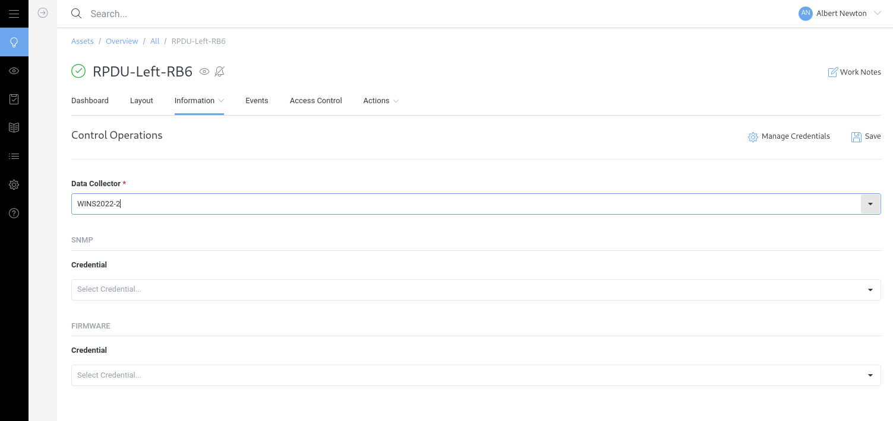

.. include:: /asset-management/media.rst
.. _Control-operations-doc:

******************
Control operations
******************
Some asset types allow Hyperview to perform certain control functions. For example, with supported hardware Hyperview can:

- Open a smart door handle
- Update firmware
- Power on, off or cycle a rack PDU outlet

These operations require appropriate authentication. The control operations page allows users with the appropriate permissions to configure authentication parameters and if needed assign a data collector.

Equivalent bulk actions allow for the bulk configuration of these credentials.

========================
Configuration parameters
========================

Data collector
--------------
Sets the data collector responsible that will receive the request.

SNMP
----
SNMP set credential.

Firmware
--------
Firmware update credential.

