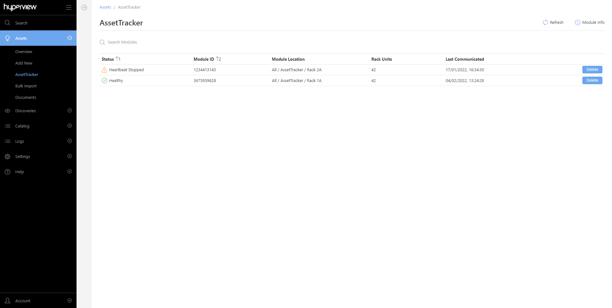

.. _AssetTracker-doc:

############
AssetTracker
############

Hyperview AssetTracker is an RFID asset management solution that lets you track and audit assets. Relevant features are only available on AssetTracker-licensed instances.

Usage examples include, but aren't limited to:

* Tag new or existing assets in your data center to start receiving real-time updates.
* Perform rack asset audits in Hyperview.
* Detect asset moves across racks and locations and automatically update corresponding records.
* Audit assets to address placement collisions.
* Scan asset tags using a barcode scanner to quickly populate relevant fields.

.. note::
	- Hyperview AssetTracker is licensed per rack
	- AssetTracker Hardware is procured separately

.. toctree::
   :maxdepth: 2

   topics/assettracker-hardware
   topics/how-assettracker-works
   topics/setup-and-configuration
   topics/moving-and-deleting-modules
