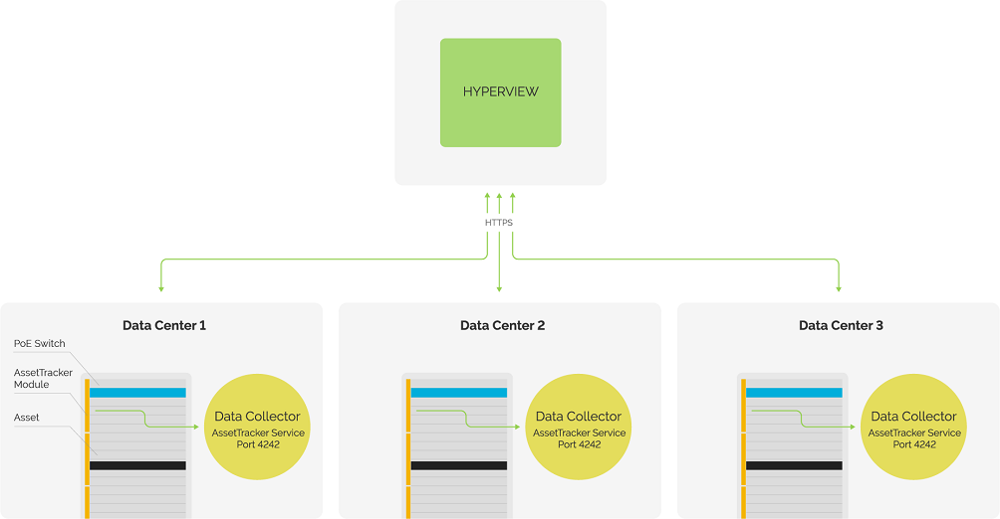
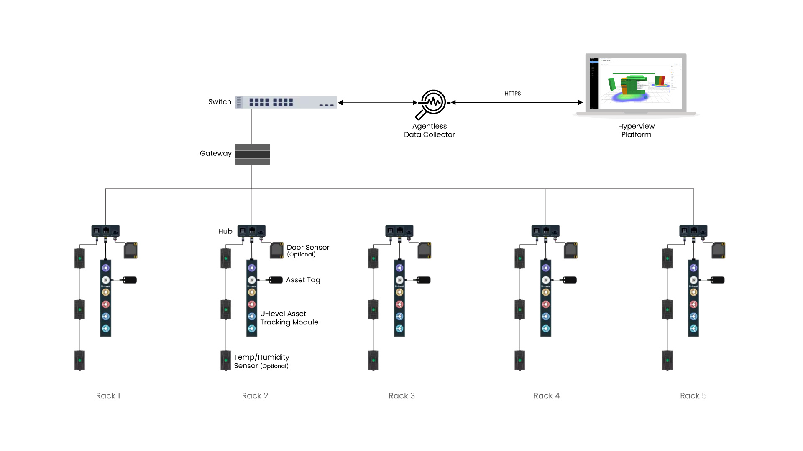
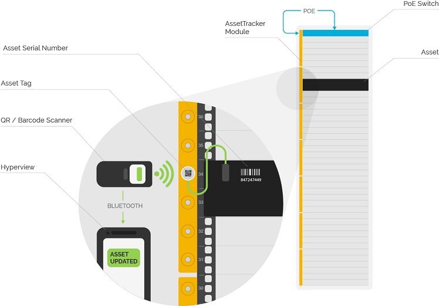

.. _How-assettracker-works-doc:

**********************
How AssetTracker works
**********************

AssetTracker builds on Hyperview's existing distributed architecture by adding specialized hardware and software to achieve automated Rack U-level tracking across one or more data centers. The Data Collector's AssetTracker component (DCAT) communicates with hardware modules called "master modules" that are installed on racks.

Master modules are powered by an AssetTracker gateway. Gateways depending on the model, are powered by a POE power source or a rack PDU.

Master Modules are 6 RUs long and can be expanded using extension modules. Each master module has a unique Master Module ID that is associated with a rack. Master modules connect to a gateway and gateways are configured to communicate with a dedicated Data Collector which in turn communicates with Hyperview.

AssetTracker modules in turn are magnetically connected to specialized RFID tags that are attached to assets ("asset tags"). Each asset tag has its unique AssetTracker ID. You can scan asset tags using a compatible barcode or QR code scanner to input AssetTracker ID values directly in Hyperview. As soon as the Data Collector is registered with Hyperview, the DCAT starts listening for AssetTracker tag operations and heartbeats.

Users can specify Master Module IDs (for racks) and AssetTracker IDs (for racked devices) while creating or updating relevant assets. Detected AssetTracker modules appear on the AssetTracker page (*Assets → AssetTracker*). Tagged assets can be reviewed from the parent rack's Asset Audit page (rack → *Information → Asset Audit*).

========================
Typical hybrid scenarios
========================
The following table describes placement outcomes for an AssetTracker-licensed data center that has both tracked and untracked racks.

+---------------------------------------------------------+----------------------------------------------------------------------------------------------------------+
| Scenario                                                | Outcome                                                                                                  |
+=========================================================+==========================================================================================================+
| Asset tag is accidentally or intentionally removed      | The asset is moved to the current rack's Unplaced grid                                                   |
+---------------------------------------------------------+----------------------------------------------------------------------------------------------------------+
| Tagged asset is moved within a tracked rack             | The asset's RU is automatically updated in Hyperview                                                     |
+---------------------------------------------------------+----------------------------------------------------------------------------------------------------------+
| Tagged asset is moved to another tracked rack           | The asset's rack and RU is automatically updated in Hyperview                                            |
+---------------------------------------------------------+----------------------------------------------------------------------------------------------------------+
| Tagged asset is moved to an untracked rack              | | The asset is moved to the original rack's Unplaced grid                                                |
|                                                         | | (You must update the rack and RU values manually)                                                      |
+---------------------------------------------------------+----------------------------------------------------------------------------------------------------------+
| Untagged asset is moved to a tracked rack               | | Undetected                                                                                             |
|                                                         | | (You must update the rack and RU values manually)                                                      |
+---------------------------------------------------------+----------------------------------------------------------------------------------------------------------+
| Untagged asset is moved to an untracked rack            | | Undetected                                                                                             |
|                                                         | | (You must update the rack and RU values manually)                                                      |
+---------------------------------------------------------+----------------------------------------------------------------------------------------------------------+

=================
Known limitations
=================
AssetTracker has the following known limitations. We aim to address some of these in future releases.

* AssetTracker can only place assets in the front of the rack.
* Tagged zero U assets can be tracked to the specific rack, but not at the Rack Elevation level.
* Shelved assets are not supported. AssetTracker will attempt to move tagged shelved assets to a non-shelf position in the Rack Elevation, or un-place them in the rack.
* Side-by-side asset positions are currently not supported.

=======================
Tested barcode scanners
=======================
.. note:: The following barcode scanners have been tested officially tested for AssetTracker. However, other scanners should work as well (provided they are properly configured; please refer to your scanner's documentation). The scanner must be connected to a device running Hyperview on a supported web browser to be able to input AssetTracker IDs.

* **NETUM NT-1228BL.** You must configure the device by scanning the Terminator barcode (3030052 CR).
* **KOAMTAC KDC300.** The specific model we tested is KDC300iM-SR.
