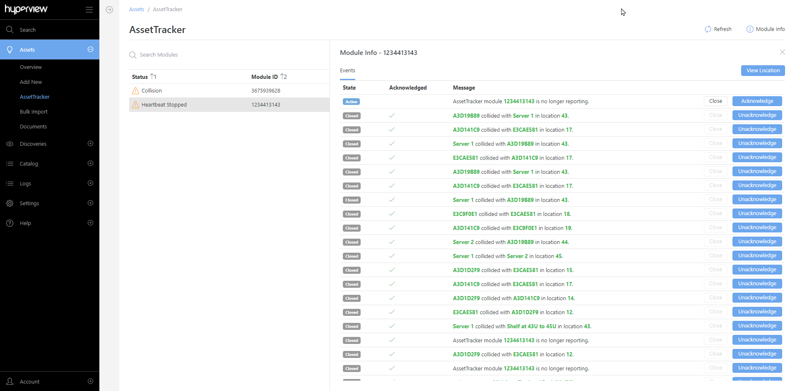

.. _Moving-and-deleting-modules-doc:

***************************
Moving and deleting modules
***************************

AssetTracker automatically handles asset moves. Assuming there are no collisions if you physically move a tagged device, the corresponding asset in Hyperview will get moved to the new position during the next DCAT monitoring cycle (which occurs every 10 minutes). Asset move events appear in the rack and asset Change Log pages. If the asset does not get moved, proceed to the AssetTracker page (*Assets → AssetTracker*) to review and address any relevant issues.

================================
Searching asset tags and modules
================================
To find existing AssetTracker tags and modules to move (or audit), :ref:`use the Filters panel in the Advanced Search page<Search-features>` to add asset property filters for AssetTracker ID and AssetTracker Master Module ID.

================
Deleting modules
================
#. Detach the master module from its present rack.
#. Open the AssetTracker page (*Assets → AssetTracker*) and select the corresponding module.
#. Click *Delete → Delete*.

Repeat the steps for additional modules that you want to retire or remove as needed.

=======================
Collisions and warnings
=======================
Under certain circumstances AssetTracker will fail to move an asset into the intended rack U. This could be due to:

* The asset tag is placed in the wrong slot on the AssetTracker module or the wrong module.
* The model information for the incoming asset, the existing asset, or both is incorrect.
* An untagged asset already exists in the target position.

These kinds of placement conflicts are referred to as "collisions". Hyperview issues a warning whenever it encounters collisions (and/or other issues) so that you can take the appropriate corrective action.

Possible warnings
-----------------
* **Unknown Module:** Issued for the All location when AssetTracker detects a module that is not associated with a rack.
* **Unknown Tag:** Issued at the rack level when a detected asset tag is not associated with a Hyperview asset.
* **Collision:** Issued at the rack level when a detected tagged asset collides with another asset in the same position.
* **Heartbeat Stopped:** Issued at the rack level when a module has not reported its status for more than 30 minutes.
* **Module and Rack Size Mismatch:** Issued at the rack level when a module reports a size that does not match the rack it is associated with in Hyperview.

Viewing AssetTracker events
---------------------------
#. Open the AssetTracker page (*Assets → AssetTracker*).
#. Select the intended module → *Module Info*.
#. Proceed to acknowledge or close event messages as appropriate. You can also navigate to the module's location using the View Location button.
