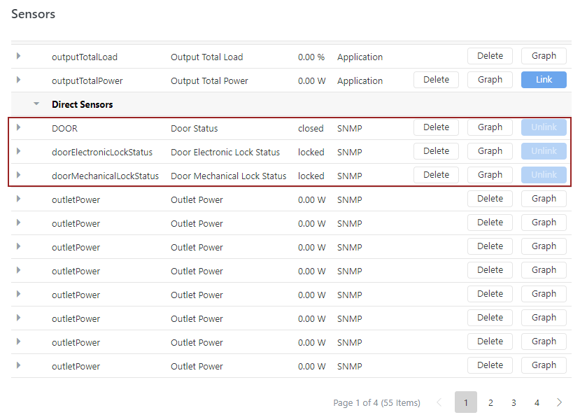
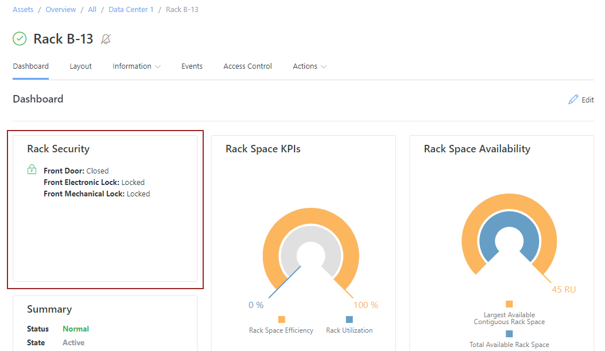
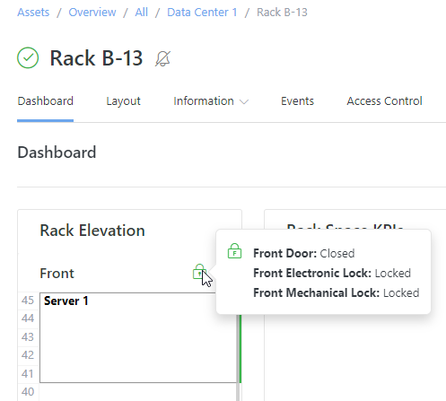
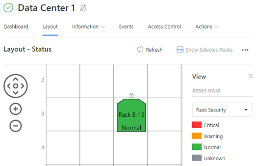
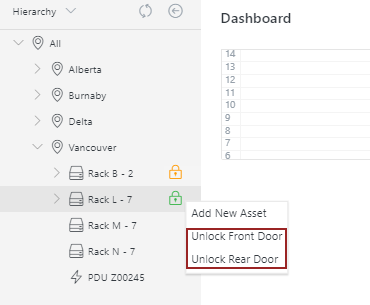
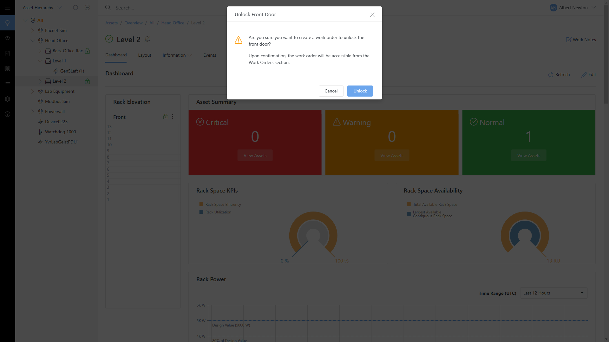
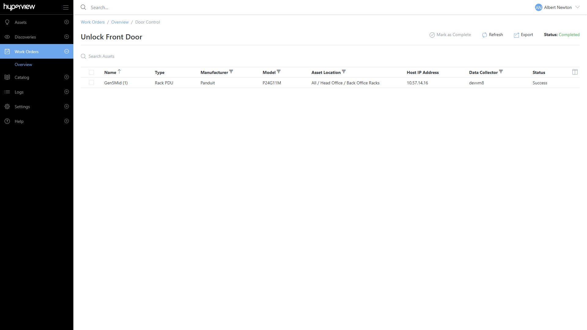
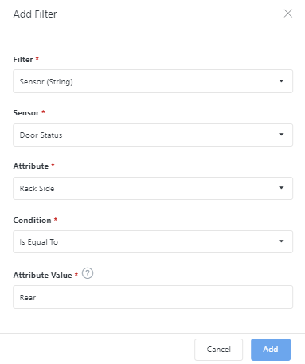
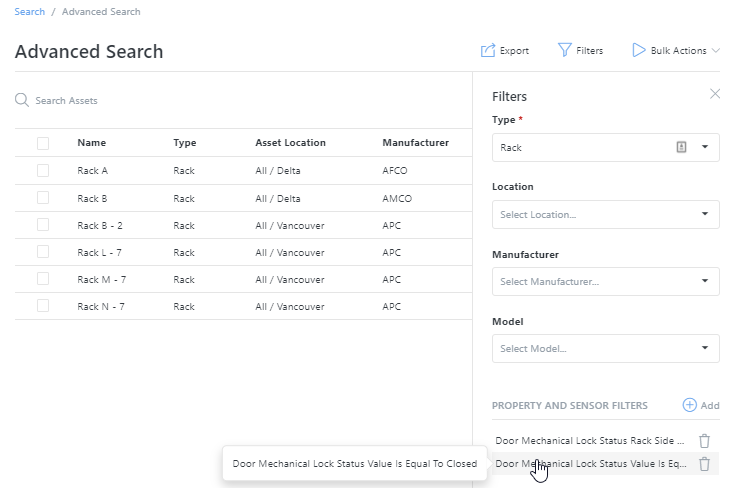

.. _Rack-security-doc:

*************
Rack Security
*************

Hyperview Rack Security lets you visualize and interact with rack door access controls for security-enabled racks. It is a separately licensed set of features that are only available for Rack Security-licensed instances, and only apply to security-enabled racks. For compatibility information see :ref:`Supported-hardware`.

.. note:: To confirm if you have a Rack Security license, check the License page (*Settings → License*, Administrator-only).

.. _Supported-hardware:

==================
Supported hardware
==================
Rack Security currently supports Panduit SmartZone G5 rack PDUs with Rack Access Control sensors and accessories.

=========================
Linking rack door sensors
=========================
With Rack Security, you do not need to manually link door sensors — they will be automatically linked in Hyperview when you add the connected rack PDU to the rack. To do so:

1. Discover the rack PDU.
2. Drag the rack PDU under the target rack in the Asset Hierarchy. The location of the sensor, i.e. Front or Rear is inferred from the rack PDU configuration.

.. image:: media/rpdu_added.png
   :width: 1091px
   :alt: rPDU Added
   :class: border-black

The ``DOOR``, ``doorElectronicLockStatus`` and ``doorMechanicalLockStatus`` sensors will now be listed on the rack PDU's Sensors page (*Information → Sensors*). The read-only Unlink button implies that the sensor is already linked and cannot be linked or unlinked manually.

.. _Setting-control-credentials:

===========================
Setting control credentials
===========================
If a rack PDU requires access control credentials (typically to allow remote door unlock requests), an Administrator can add them from existing Discovery credentials. Only SNMP v1 and v2 credentials are supported at the moment.

1. Open the rack PDU's *Information → Control Operations* page.
2. Select the intended credentials from the dropdown list and click *Save*.

If the intended credentials do not exist, you can add them via *Manage Credentials → Add*. You may need to refresh the Control Operations page for the new credentials to appear in the dropdown list.

Control credentials can also be added in bulk using a :ref:`bulk action<Bulk-actions-doc>` from Advanced Search, an "Assets by Type" grid or the information -> Assets grid.

================================
Viewing a rack's security status
================================
Rack Security sensors are visualized ("decorated") or displayed in the following places in Hyperview:

* The Rack Security widget
* The Rack Elevation widget
* The Rack Security layout view
* The Hierarchy tree
* The Sensors page of applicable rack PDUs or racks

The security status for the overall rack (and/or a rack side) is indicated using a lock icon. The lock color will change depending on the status (green = normal, red = critical, yellow = warning, gray = unknown).

The various nuances in Rack Security decorations are covered in the following subsections.

In addition, Advanced Search can be used to generate a status report of all security sensors, depending on the search parameters. This search can then be saved and shared with internal users.

In the Rack Security widget
---------------------------
You can add the Rack Security widget from a rack's Dashboard (*Dashboard → Edit → Add Widget*). It only shows the security status (lock icon and text) for rack sides that have at least one security sensor.

* If the rack has sensors on both sides, then the rack security status is shown for both sides.
* If the rack has partial sensors on a side, then the rack security status is shown but missing sensors are marked as "Unknown".
* If the rack has no associated rack security sensors, a "No rack security sensors detected" message is displayed.

In the Rack Elevation widget
----------------------------
You can add the Rack Elevation widget from a rack's Dashboard (*Dashboard → Edit → Add Widget*). It also appears on the rack's Layout page, and wherever multi-rack views are displayed (for example, if you click on *Show Selected Racks* while multi-selecting racks in a location layout). The popover on the lock icon in the Rack Elevation widget shows the rack security status for sides that have at least one rack security sensor.

* No rack security decorations are shown if the rack has no associated rack security sensors.
* If the rack has partial sensors on a side, the rack security status is shown but missing sensors are marked as "Unknown".

In the Rack Security view of a location layout
----------------------------------------------
To view the security status of racks under a given location, go to the location's Layout page → *View* → select "Rack Security" from the Asset Data dropdown.

* The rack color (and associated text) will indicate the security status.
* The layout only shows lock icons (using the appropriate color) for rack sides that have door sensors.

In the Hierarchy
----------------
Lock icons will appear in the asset hierarchy tree for racks that have security sensors.

.. image:: media/hierarchy_icon.png
   :width: 488px
   :alt: Location hierarchy icon popover
   :class: border-black

* Only security-enabled racks will have lock icons.
* The lock icon color will indicate the overall security status of the rack.
* Hovering on the lock icon will show a pop-up with door-specific icons and sensor details.
* If the rack has sensors on both sides, then the lock icon and pop-up text will be displayed on both sides.
* If the rack has partial sensors on either side, then the lock icon will reflect the rack security status but the missing sensors will be listed as "Unknown".

====================
Unlocking rack doors
====================
Administrators and Data Center Managers can remotely unlock security-enabled rack doors using the Unlock Front Door and Unlock Rear Door commands (provided control credentials have been already set on applicable rack PDUs; see :ref:`Setting-control-credentials`). The door unlock commands can be accessed from either of the following places.

From the right-click menu from the security-enabled rack in the Asset Hierarchy tree:

Or from the security-enabled rack's Actions dropdown:

.. image:: media/actions_unlock.png
   :width: 677px
   :alt: Actions menu unlock
   :class: border-black

Triggering the unlock action will create a work order.

The work order can then be tracked from the work orders page.

=========================================
Auditing and reporting door sensor values
=========================================
Several built-in Hyperview features can be used to monitor, review, and report on the Rack Security status of eligible racks across your data centers.

View historical sensor data
---------------------------
The Graph button on the rack Sensors page (*Information → Sensors → Graph*) can be used to view graphical representations of door sensor data within a selected timeframe.

.. image:: media/sensor_timeline.png
   :width: 704px
   :alt: Sensors timeline chart
   :class: border-black

Find and export sensor data for all or some racks
-------------------------------------------------
You can filter the Advanced Search grid (*Search → Advanced → Filters*) to find racks with door security sensors that are on a certain rack side or have a certain value. Combining these filters can help you further refine search results. You can export records as you would from the Rack Assets By Type page.

Get notified about door sensor events
-------------------------------------
As long as you have read access to the rack PDU, you can watch it (*Actions → Start Watching*) to receive email notifications for related events.

.. note:: Any user can receive read-only event notifications for security-enabled rack doors. However, only Administrators and Data Center Managers can acknowledge or close them. Sensitive data such as electronic lock pin codes will appear masked in application and asset event records, email notifications, and log files.

=====================
Troubleshooting notes
=====================
* You will need to add the Data Collector server's IP address in the rack PDU  admin panel (open the rack PDU's IP address in your browser) to receive applicable trap events. You will also need to verify your email address for Hyperview (*Account → Profile → Send verification email* → verify).
* Due to the polling interval and other data transmission factors, the rack PDU's Events page might not list the door unlock event until several minutes after the event has taken place.
* After sending an unlock request to an electronic lock in Hyperview, it may take up to 30 seconds before the request is received by the lock.
* After manually locking and unlocking a mechanical lock it may take Hyperview up to 4 minutes to detect the change. This will be improved in the future.
