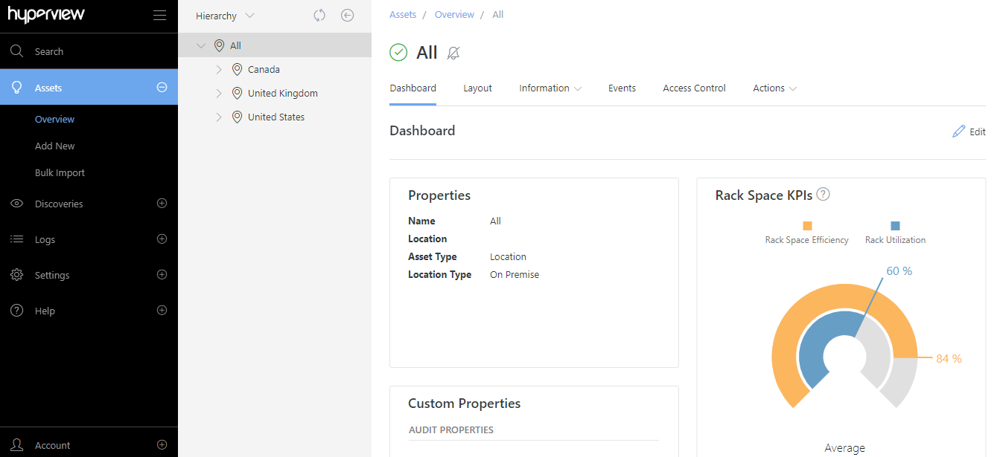

#########
Version 1
#########

*********************************
Hyperview 1.6 (February 01, 2021)
*********************************

This section covers significant new features, enhancements, and bug fixes in Hyperview 1.6.x since version 1.5.x.

.. raw:: html

	<iframe src="https://player.vimeo.com/video/509055125" width="640" height="360" frameborder="0" allow="autoplay; fullscreen" allowfullscreen></iframe>

===============================
User provisioning with Azure AD
===============================
Hyperview now supports auto-provisioning user accounts for Azure Active Directory domains. Administrators can use the new User Provisioning page (*Account → Profile → User Provisioning*) to view and manage Azure AD domains, which are mapped to specific user roles and groups.

For example, you can create an Azure AD domain for Data Center Managers who are spread across the "DCM 1", "DCM 2", and "DCM 3" groups. Corresponding users will be auto-provisioned upon logging into Hyperview with their Microsoft login; you do not need to manually create user accounts for them.

On the other hand, users who do not belong to a configured Azure AD domain will get an "Access Denied" upon trying to log in with their external login credentials, thereby ensuring that only intended individuals have application access.

========================
Enhanced user management
========================
Administrators can now use the Users page (*Account → Profile → Users*) to bulk-update existing user accounts and export grid data.

The new Bulk Actions menu lets you perform the following actions against one or more selected users: Lock, Unlock, Add To Group, Remove From Group, Enable External Login Required, Disable External Login Required, Delete. Any non-applicable contexts, such as the fact that you cannot delete your own user account, will automatically be taken into consideration by the application. As a result, if you try to delete all existing user accounts including your own, the command will be processed but your account will not be deleted.

The new Export button lets you export the data and columns currently showing in the grid in XLSX format, and behaves like the same feature elsewhere in the application.

============================
Improved support for busways
============================
Starting with Hyperview 1.6, busways can be specified as power sources for other assets (browse to asset → *Information → Power*). Currently, one outlet is supported per busway tap-off, and a single asset can be connected to a tap-off outlet. Correspondingly, asset power paths (browse to asset → *Information → Power Path*) now show connected busways.

Furthermore, busway assets now have a Layout page (browse to busway → click *Layout* tab), which lets users view a grid of existing tap-offs. Power Users and above can use the Layout page to add, edit, or delete tap-offs, as well as connect or disconnect assets.

=======================================================
Non-numeric BACnet/IP and Modbus TCP sensor definitions
=======================================================
Administrators can now define non-numeric sensors as part of BACnet/IP definitions (*Settings → BACnet/IP Definitions*) and Modbus TCP definitions (*Settings → Modbus TCP Definitions*). For either protocol, use the new Non-numeric Sensors tab to search and manage non-numeric sensor definitions.

=========================
Enhanced sensor analytics
=========================
Several 1.6 features allow users to analyze sensor data more efficiently.

The Sensors page (browse to asset → *Information → Sensors*) now lets you download raw sensor data in CSV format via a new Export Data button. This is available to all Hyperview users irrespective of role, provided that they have access to the asset in question.

In addition, you can now select a custom date range while using the Graph button to generate a sensor graph. Furthermore, generated graphs can be exported as JPEG, PDF, PNG, or SVG files.

==========================
Other notable enhancements
==========================

* The map marker tooltip for Map layouts has been improved to be more legible.

===========
API changes
===========
All API changes are reflected in the corresponding Open API (aka Swagger) interfaces, which can be accessed from the *Help* menu.

The following endpoints have been added to the Hyperview API. Additionally, various object definitions have been improved for the Hyperview and Data Collector APIs. No Data Collector API endpoints were added or updated.

New /buswayTapOffs endpoints
----------------------------

* ``/api/v1/asset/availablePowerSources/buswayTapOffs/{id}`` returns available busway tap-offs.
* ``/api/v1/asset/buswayTapOff/{assetId}`` lets you retrieve a list of busway tap-offs, or create a busway tap-off.
* ``/api/v1/asset/buswayTapOff/{buswayTapOffId}`` lets you update or delete an existing busway tap-off.

New /bacnetIpDefinitions/bacnetIpNonNumericSensors endpoints
------------------------------------------------------------

* ``/api/v1/setting/bacnetIpDefinitions/bacnetIpNonNumericSensors/{bacnetIpDefinitionId}`` lets you retrieve a list of BACnet/IP non-numeric sensor definitions, or create one.
* ``/api/v1/setting/bacnetIpDefinitions/bacnetIpNonNumericSensors/{bacnetIpDefinitionId}/{bacnetIpNonNumericSensorId}`` lets you update or delete an existing BACnet/IP non-numeric sensor definition.

New /modbusTcpDefinitions/modbusTcpNonNumericSensors endpoints
--------------------------------------------------------------

* ``/api/v1/setting/modbusTcpDefinitions/modbusTcpNonNumericSensors/{modbusTcpDefinitionId}`` lets you retrieve a list of Modbus TCP non-numeric sensor definitions, or create one.
* ``/api/v1/setting/modbusTcpDefinitions/modbusTcpNonNumericSensors/{modbusTcpDefinitionId}/{modbusTcpNonNumericSensorId}`` lets you update or delete an existing Modbus TCP non-numeric sensor definition.

Deprecated endpoints
--------------------
No endpoints were deprecated in this release.

============
Known issues
============

* **AS-8170** The user session expires after a short period of inactivity if you have Hyperview open across multiple browser tabs.
* **AS-8626** Pressing the Enter key while adding a new custom property throws a validation error.

=================
Notable bug fixes
=================

* **AS-8126** (Rack Security-licensed instances only) The Asset Hierarchy tree was over-fetching rack security-enabled racks. This has been fixed.
* **AS-8160** While bulk deleting Advanced Search rows, the operation would remember row selections from previous queries. This has been fixed.
* **AS-8181** While adding SNMP ports for discovery, invalid port numbers were automatically getting assigned default values. This has been fixed.
* **AS-8338** (API only) PUT ``/api/v1/asset/monitorOnlyCommunicationSetting/{​​assetId}​​`` now correctly updates the monitoring state for assets that are set to a Discovered monitoring profile.
* **AS-8398** (Rack Security-licensed instances only) Swipe card alarm events were not always masking the card ID. This has been addressed.
* **AS-8436** While manually adding a new asset, the Definition list for BACnet/IP or Modbus TCP monitoring profiles would not get refreshed if you changed the Type. This has been fixed.
* **AS-8455** A console error would be thrown while adding an Address value to a location for the first time.

*****

*********************************
Hyperview 1.5 (December 22, 2020)
*********************************

This section covers significant new features, enhancements, and bug fixes in Hyperview 1.5.x since version 1.4.x.

.. raw:: html

	<iframe src="https://player.vimeo.com/video/493474498" width="640" height="360" frameborder="0" allow="autoplay; fullscreen" allowfullscreen></iframe>

================================
BACnet/IP and Modbus TCP support
================================
Hyperview now supports the BACnet/IP and Modbus TCP protocols.

Manage BACnet/IP definitions and relevant sensors
-------------------------------------------------
Administrators can use the new BACnet/IP Definitions page (*Settings → BACnet/IP Definitions*) to manage BACnet/IP definitions. Additionally, you can click on the *Numeric Sensors* tab to manage numeric sensor definitions associated with a certain BACnet/IP definition.

Manage Modbus TCP definitions and relevant sensors
--------------------------------------------------
Administrators can use the new Modbus TCP Definitions page (*Settings → Modbus TCP Definitions*) to manage Modbus TCP definitions. Additionally, you can click on the *Numeric Sensors* tab to manage numeric sensor definitions associated with a certain Modbus TCP definition.

New Monitoring section while adding a new asset
-----------------------------------------------
A Monitoring Profile field has been added to the Add New page (*Assets → Add New* or via right-click in Asset Hierarchy → *Add New Asset*; only accessible by Power Users and above). Possible values are: "Discovered" (default), "BACnet/IP", and "Modbus TCP". Selecting either "BACnet/IP" or "Modbus TCP" will surface relevant protocol-specific fields.

Enhanced Monitoring page
------------------------
Power Users and above can now use the Monitoring page (browse to asset → *Information → Monitoring*) to update an asset's monitoring profile (Discovered, BACnet/IP, or Modbus TCP). You can also refresh the device data using the latest device definition, where applicable. Saving the page will create individual Change Log events per new or updated monitoring property.

========================
Enhanced user management
========================
User-related features have been significantly enhanced to support external login-only access on a per-user basis and to allow for applying asset access policies across groups of people.

External login enforcement
--------------------------
Administrators can now force users to access Hyperview using their external login provider from the Users grid (*Account → Profile → Users*).

From a user's standpoint, attempting to log into an external login-enforced account using a Hyperview username and password will throw an error. Additionally, the "Manage your account" page (*Account → Profile*) will no longer feature *Password*, *External Logins*, and *Two-Factor Authentication* links.

User groups
-----------
Administrators can use the new Groups page (*Account → Profile → Groups*) to manage groups. For example, you can create groups for specific teams in your organization, such as developers, business analysts, managers, and so on.

Administrators can use the Users page (*Account → Profile → Users*) to add a new user to existing groups, or update an existing user's group memberships. Users can see what groups they belong to from their Profile page (*Account → Profile → Profile*).

Users grid enhancements
-----------------------
The Users grid (*Account → Profile → Users*) features four new columns:

* Two Factor Auth (indicates if 2FA is turned on)
* External Logins (indicates configured external login providers; only Microsoft is currently supported)
* External Login Required (lets you toggle the external login requirement)
* Groups (lists groups the user belongs to)

Distinct Application Log entries for external logins
----------------------------------------------------
The Application Log (*Logs → Application Log*) now distinguishes between external login events and Hyperview login events, citing the external login that was used (currently only Microsoft is supported).

=========================
Asset access enhancements
=========================
Access policy groups
--------------------
Administrators can now use the Access Policies page (*Settings → Access Policies*) to specify groups that a certain access policy will apply to. Allowed groups for an access policy will appear in an asset's Access Control page (browse to asset → *Access Control*), provided the same access policy is currently selected.

Access Policies grid enhancement
--------------------------------
The Access Policies grid (*Settings → Access Policies*) now features an Associated Groups column, which indicates the number of groups associated with a given access policy.

==========================
Other notable enhancements
==========================

* The Hierarchy tree has been renamed to Asset Hierarchy for ease of reference.
* Asset labels in Rack Elevation views are now more legible.
* IxOS discoveries now return Model and Serial Number values for ports.

===========
API changes
===========
All API changes are reflected in the corresponding Open API (aka Swagger) interfaces, which can be accessed from the *Help* menu.

The following endpoints have been added in the Hyperview API. In addition, various object definitions have been improved for the Hyperview and Data Collector APIs. No Data Collector API endpoints have been added or updated.

New /accessPolicyGroups endpoints
---------------------------------

* ``/api/v1/setting/accessPolicyGroups`` returns groups of users that can be associated with an asset access policy.
* ``/api/v1/setting/accessPolicyGroups/{accessPolicyId}`` retrieves groups associated with a specific access policy.

New /bacnetIpDefinitions endpoints
----------------------------------

* ``/api/v1/setting/bacnetIpDefinitions`` lets you retrieve a list of BACnet/IP definitions, or create one.
* ``/api/v1/setting/bacnetIpDefinitions/{bacnetIpDefinitionId}`` lets you retrieve, delete, or update a specific BACnet/IP definition.
* ``/api/v1/setting/bacnetIpDefinitions/bacnetIpNumericSensors/{bacnetIpDefinitionId}`` lets you retrieve numeric sensor definitions associated with a BACnet/IP definition, or create such a numeric sensor definition.
* ``/api/v1/setting/bacnetIpDefinitions/bacnetIpNumericSensors/{bacnetIpDefinitionId}/{bacnetIpNumericSensorId}`` lets you delete or update a numeric sensor definition associated with a BACnet/IP definition.

New /modbusTcpDefinitions endpoints
-----------------------------------

* ``/api/v1/setting/modbusTcpDefinitions`` lets you retrieve Modbus TCP definitions, or create one.
* ``/api/v1/setting/modbusTcpDefinitions/{modbusTcpDefinitionId}`` lets you retrieve, delete, or update a specific Modbus TCP definition.
* ``/api/v1/setting/modbusTcpDefinitions/modbusTcpNumericSensors/{modbusTcpDefinitionId}`` lets you retrieve numeric sensor definitions associated with a Modbus TCP definition, or create such a numeric sensor definition.
* ``/api/v1/setting/modbusTcpDefinitions/modbusTcpNumericSensors/{modbusTcpDefinitionId}/{modbusTcpNumericSensorId}`` lets you delete or update a numeric sensor definition associated with a Modbus TCP definition.

New /monitorOnlyCommunicationSetting endpoints
----------------------------------------------

* ``/api/v1/asset/monitorOnlyCommunicationSetting/{assetId}`` lets you retrieve or update the monitoring setting for a specific asset (note: see AS-8338 under Known Issues).
* ``/api/v1/asset/monitorOnlyCommunicationSetting/{assetId}/refreshSensors`` refreshes the asset monitoring sensors for a given asset from "monitor only" definitions.

Deprecated endpoints
--------------------
No endpoints were deprecated in this release.

============
Known issues
============

* **AS-7654** Panduit Gen3 (Unite/Sinetica based) rack PDU appears as an environmental monitor.
* **AS-7879** The All location in the Asset Hierarchy does not always expand by default.
* **AS-8160** While attempting to bulk delete Advanced Search rows, the operation remembers row selections from previous queries.
* **AS-8164** The Add New modal crashes while adding a rack, rack PDU or PDU with missing model data.
* **AS-8166** Often cannot add assets to shelves due to inactive Add button.
* **AS-8180** You are able to set the RackU size of a rack to 0, which is incorrect.
* **AS-8321** The View button is unavailable while editing a location layout in Map Mode.
* **AS-8338** (API only) PUT ``/api/v1/asset/monitorOnlyCommunicationSetting/{​​assetId}​​`` does not correctly update the monitoring state for assets that are set to a Discovered monitoring profile.
* **AS-8354** While editing a BACnet/IP or Modbus TCP definition, the breadcrumb trail link for the same opens the All assets page.
* **AS-8442** Users cannot clear an asset's Lifecycle fields after saving them.

=================
Notable bug fixes
=================

* **AS-6161** The Rack Space KPIs widget for location dashboards no longer repeats legend values.
* **AS-7631** SSH key discoveries work with new keys.
* **AS-7846** Fixed sorting issue with asset types listed in the Assets By Type widget for locations.

========================
Changes in version 1.5.1
========================
Bug fixes
---------
* **AS-8446** The Definition field on the *Information → Monitoring* page was blank for assets that have Monitoring Profile set to "BACnet/IP" or "Modbus TCP". Definition selection options for the field were also unavailable. Both issues have now been addressed.

*****

*********************************
Hyperview 1.4 (November 27, 2020)
*********************************

This section covers significant new features, enhancements, and bug fixes in Hyperview 1.4.x since version 1.3.x.

.. raw:: html

	<iframe src="https://player.vimeo.com/video/485601861" width="640" height="360" frameborder="0" allow="autoplay; fullscreen" allowfullscreen></iframe>

============================
Advanced Search enhancements
============================
"Best fit" search refinements
-----------------------------
You can now add filters for location, rack total power, rack security sensor value and status, and largest available contiguous rack space (aka "best fit"). This makes it trivial to search for, for example, a rack in your Florida data center with a total power of at least 2000W which has locked front and back doors, and has more than 10 free rack units.

Asset status column
-------------------
The Advanced Search grid now has a Status column by default.

Ability to explicitly remove Location filter
--------------------------------------------
Previously you had to reset filters to remove an applied Location filter. Now you can remove the Location filter like any other filter.

==============================
Sensor management enhancements
==============================
Sensor thresholds
-----------------
Starting with Hyperview 1.4, Administrators can configure sensor thresholds from *Settings → Sensors → Thresholds*. This includes adding, removing, enabling, and disabling sensor thresholds. Once a certain threshold is reached, it will generate a relevant event in the application. Depending on the event severity and event notification rules, a notification email will be sent to the user, as appropriate. For example, you can define a sensor threshold to throw a warning whenever a server's temperature exceeds 85°F. You can even add an optional "And" condition to fine-tune thresholds even further.

Improved sensor deletion
------------------------
Deleting a sensor now also deletes its historical data. Admin-only.

Improved polling for asset sensors
----------------------------------
Traps received for a given asset now trigger the Data Collector to retrieve the latest asset information.

========================
Blade asset enhancements
========================
Bay location data for Blade devices
-----------------------------------
Blade devices now list the bay location as an asset property. The property value is auto-detected during discoveries (whenever possible).

Improved support for Blade Enclosure as a location
--------------------------------------------------
The process of adding a Blade Server, Blade Network or Blade Storage to a Blade Enclosure has been simplified. Since bay location is now an asset property, the "Place in Blade Enclosure" modal no longer appears while dragging Blade devices in the asset hierarchy tree from one Blade Enclosure to another.

Improved Blade Enclosure sensors
--------------------------------
The ``rackTotalPowerBasedOnChildConsumingDevices`` computed sensor for racks has been improved to account for all related power-consuming devices. Power from Blade Enclosures is now taken into account.

=============================================
Rack Security enhancements (licensed feature)
=============================================
Rack Security status in Asset Hierarchy
---------------------------------------
Provided you have the Rack Security license, the Asset Hierarchy tree now shows the lock icon (reflecting the appropriate status) for Rack Security-enabled racks.

==========================
Other notable enhancements
==========================
* Administrators can now initiate password reset requests on behalf of other users. Note that this does not apply to locked user accounts.
* The Asset Types tree now shows the asset count for each type. Note that count values will only reflect assets that the current user has access to.
* The Sensors grid can now be sorted by Type, Value, Source Protocol, Source Asset, Position, and Last Updated columns (in addition to existing sortable columns).
* Label text is now consistent across the Login page for login links.
* Improved Application Log event details template for CIDR Ranges.

===========
API changes
===========
All API changes are reflected in the corresponding Open API (aka Swagger) interfaces, which can be accessed from the Help menu.

Breaking change: removed /availableBladeEnclosureSpace
------------------------------------------------------
The ``/api/v1/asset/availableBladeEnclosureSpace`` endpoint has been removed. Corresponding functionality has been removed from the UI as well; for details, refer to the "Blade asset enhancements" section above.

Breaking change: updated /sensors
---------------------------------
The response body for ``/api/v1/asset/sensors/{assetId}`` previously resembled:

.. code::

	{
	  data: [ ... ]
	  _metadata: { ... }
	}

Which has now been updated to return an array of JSON objects:

.. code::

	[
	  ...
	]

In addition, the ``(after)``, ``(limit)``, ``(sort)`` and ``(filter)`` query parameters are no longer available.

Enhanced /search
----------------
The ``/api/v1/asset/search`` endpoint has been improved to allow searching for comparative custom property values. For UTC datetime/numeric comparisons, you can use:

* ``lt`` (less than)
* ``gt`` (greater than)
* ``ge`` (greater than or equal to)
* ``le`` (less than or equal to)
* ``eq`` (equal to)
* ``ne`` (not equal to)

For example, you can query assets that have a Monthly Cost custom property that was last updated after a certain UTC datetime:

.. code::

  curl -X POST "http://localhost:59695/api/v1/asset/search"
    -H  "accept: application/json"
    -H  "Authorization: Bearer TOKEN"
    -H  "Content-Type: application/json-patch+json"
    -d "{\"searchText\": \"\",\"limit\": 10,\"after\": 0,\"filter\": \"(NumericCustomProperties/any(numericcustomproperties:numericcustomproperties/Name eq \\'Monthly Cost\\' and numericcustomproperties/LastUpdated ge 2020-10-02T21:24:52.655Z))\",\"selectedFields\": [ \"DisplayName\", \"Id\", \"AssetType\" ]}"

Other new endpoints and improvements
------------------------------------
* The ``/api/v1/setting/sensorThreshold`` endpoint lets you add and retrieve sensor thresholds.
* ``/api/v1/setting/sensorThreshold/{sensorThresholdId}`` lets you update and delete a specific sensor threshold.
* The ``/api/v1/asset/rackSecurity/{locationId}/racks`` endpoint returns all rack security sensors associated with a specific location.
* The ``/api/v1/setting/sensorTypeAssetType`` endpoint now has an optional ``sensorTypeValueType`` query parameter that lets you specify the sensor type (``numeric`` or ``enum``).

In addition, various object definitions have been improved for the Hyperview and Data Collector APIs. No Data Collector API endpoints have been added or updated in this release.

============
Known issues
============
* **AS-2355** If you maximize the browser window while in a mobile-sized window width, the number of pages does not get updated.
* **AS-5781** Devices in the "Juniper EX Stacked Switch" definition stack are merging when they should not.
* **AS-6161** The Rack Space KPIs widget for location dashboards is repeating legend values.
* **AS-6484** IPMI device discovery collects device data but does not surface it in the UI.
* **AS-6821** Tooltips for Change Log events are not consistent across supported browsers.
* **AS-7118** Data Collector-initiated control requests for Panduit SmartZone G5 Rack PDUs are resulting in a timeout for SNMP Version 3 Authentication Privacy credential combinations.
* **AS-7630** Detected a race condition that causes SSH-discovered server components and software to be duplicated.
* **AS-7631** SSH key discoveries don't work with new keys.
* **AS-7640** Device data for SSH-discovered servers is inaccurate.
* **AS-7846** Asset types listed in the Assets By Type widget for locations appear unsorted.
* **AS-7867** Cannot use the browser's Back button from an asset dashboard to return to an Asset by Type grid.
* **AS-7879** The All location in the asset hierarchy tree does not always expand by default.
* **AS-8144** Scheduled discoveries are not translating to the correct timezone.

=================
Notable bug fixes
=================
* **AS-6771** Custom property choices were not being sorted in the dropdown. This has been addressed.
* **AS-7596** Sorting access policies using the Last Updated column would throw an error. This has been fixed.
* **AS-7587** An incorrect warning message would be displayed while merging an asset with another asset. This has been fixed.
* **AS-7635** Some IPMI servers were showing the same NIC twice. This has been addressed.
* **AS-7641** Info boxes were missing on discovery details pages for Included IP Addresses and Excluded IP Addresses. This has been addressed.

*****

********************************
Hyperview 1.3 (October 21, 2020)
********************************

This section covers significant new features, enhancements, and bug fixes in Hyperview 1.3.x since version 1.2.x.

.. raw:: html

	<iframe src="https://player.vimeo.com/video/471100686" width="640" height="360" frameborder="0" allow="autoplay; fullscreen" allowfullscreen></iframe>

===============
Advanced Search
===============
An "Advanced" button now appears in the Search panel that lets you drill down to exactly the data you want. You can search for a specific asset type, location, manufacturer, and model. Additionally, you can apply property filters, such as to find racks with available size and power. On top, you can export the Advanced Search grid, perform bulk operations, and even specify which columns to include in search results.

==========================
Power aggregations and PUE
==========================
Starting with version 1.3, Hyperview features a number of computed sensors (accessible from *Information → Sensors*) to help you make more informed power distribution decisions. Locations' sensor pages now list PUE1, PUE2, and PUE3. The following computed sensors have been added at the rack level: ``rackTotalPowerBasedOnPowerProvidingDevices``, ``rackTotalPowerBasedOnPowerConsumingDevices``, and ``rackTotalPowerBasedOnLinkedPowerSensors``. Please note that certain sensor values may require one or more monitoring cycles to be generated.

==================
Bulk delete assets
==================
Administrators and Data Center Managers can now bulk delete assets (*Bulk Actions → Delete*) from the Assets By Type grid, the Assets By Location grid, and the Advanced Search grid. A maximum of 1000 assets can be bulk deleted at a time. The user can choose to receive a confirmation email once the job is completed.

==================================
Configure sensor polling intervals
==================================
Administrators can now configure global settings for sensor polling intervals. The polling interval can be set from *Settings → Sensors → Polling*. The minimum polling interval is 5 minutes; however, please note that the actual interval may vary due network latency and saturation, destination device load, Data Collector load, and device reachability.

======================
Sensor graphs and data
======================
Starting with 1.3, all users with read access can generate sensor graphs from an asset's Sensors page (*Information → Sensors → Graph*). Graphs can be generated for both numeric and string values over a UTC time interval. Daily sensor data summaries can be stored for up to ten years, depending on your Hyperview license.

===================
Layout enhancements
===================
Delete or remove multiple layout items
--------------------------------------
You can now multi-select and delete shapes, tiles, and labels from a layout. Similarly, you can multi-select and remove assets.

SVG support
-----------
Starting with version 1.3, you can upload layout images in Scalable Vector Graphics (SVG) file format.

Dynamic model representation
----------------------------
If you change the model of an asset currently showing in the layout, the asset will be automatically updated to resemble the correct model — instead of having to manually remove and re-add the asset.

Improved restrictions
---------------------
If a layout has a background image, you won't be able to remove it until you have removed existing layout items.

============================
Asset Hierarchy enhancements
============================
Faster loading time
-------------------
The Asset Hierarchy has been improved to expand branches up to 200% faster, especially if you have a large number of locations and assets.

Improved scrollbar
------------------
The Asset Hierarchy scroll bar has been fine-tuned to prevent accidental drag-and-drops.

Improved sorting
----------------
The Asset Hierarchy is now sorted by locations, racks, then everything else (in that order).

==========================
Other notable improvements
==========================
* The Rack Elevation widget now scales smoothly in Firefox and Edge Chromium when you resize the browser windows.
* The Reset Password page now only accepts complete email addresses to prevent human error.
* The Change Log and Application Log grids can now be exported.
* Custom property values of string type now support special characters.

===========
API changes
===========
All API changes are reflected in the corresponding Open API (aka Swagger) interfaces, which can be accessed from the Help menu.

New endpoints and improvements
------------------------------
The following endpoints have been added to the Hyperview API:

* ``/api/v1/asset/bulk/assets/delete`` sends an asset bulk delete request.
* ``/api/v1/asset/search`` now supports additional optional fields (no breaking changes).
* ``/api/v1/asset/search/facets`` returns all search entries matching the specified facet (i.e. grouping).
* ``/api/v1/setting/systemSettings/dataCollector/{dataCollectorSetting}`` lets you retrieve or update a Data Collector setting.

.. note:: The ``/api/v1/asset/search`` is subject to minor changes in upcoming releases.

In addition, various object definitions have been improved for the Hyperview and Data Collector APIs. No Data Collector API endpoints have been added or updated in this release.

Deprecated endpoints
--------------------
No endpoints have been deprecated in this release.

============
Known issues
============
* **AS-2355** Page count does not update dynamically when the application window is resized.
* **AS-5489** The "Show Selected Racks" button is active even when there are no racks to select in a layout.
* **AS-6161** The Rack Space KPIs widget duplicates the Rack Space Efficiency and Rack Utilization keys.
* **AS-6294** Size restrictions for Dashboard widgets are often incorrectly applied, leading to very large or duplicated widgets.
* **AS-6294** Discovering certain Dell PowerEdge servers via IPMI captures device data, but does not display it on the UI.
* **AS-6771** Custom property choices are not sorted in the dropdown.
* **AS-7333** The application does not refresh when resizing vertically.
* **AS-7631** SSH key discoveries do not work using new keys.
* **AS-7635** Some IPMI servers show the same NIC twice.
* **AS-7641** Info boxes are missing on discovery details pages for Included IP Addresses and Excluded IP Addresses.
* **AS-7654** Panduit Gen3 (Unite/Sinetica-based) rack PDUs appear as environmental monitors.
* **AS-7746** The Model dropdown is not showing discovered models during asset creation.
* **AS-7755** Attempting to update virtual server names throws an API exception.
* **AS-7761** Asset discovery reports are not updating the discovery time for the last discovery run.
* **AS-7769** Discovering Eaton rack PDUs throws an unhandled exception.
* **AS-7804** The Swagger interfaces for Hyperview API and Data Collector API (under the *Help* menu) cannot be used to make API calls. As a workaround, you can copy the generated code from Swagger to make calls using a REST API client, such as Postman.

=================
Notable bug fixes
=================
* **AS-6819** Addressed a firmware issue with Panduit Gen5 PDUs that was arbitrarily swapping temperature sensor names.
* **AS-5462** Fixed a scrolling issue with the Rack Elevation widget.
* **AS-7282** In some cases, invalid outlet status values were generated for Panduit Gen5 rack PDUs. This has been addressed.
* **AS-7759** The Add New modal would crash while adding certain assets. This has been fixed.

========================
Changes in version 1.3.1
========================
Bug fixes
---------
* **AS-7591** Right-clicking in the Asset Hierarchy tree would open the browser context menu instead of the application context menu. This has been fixed.
* **AS-7744** If you applied Advanced Search filters and did not get any matches for your query, the expected "No assets match your search" message would not get displayed. This has been addressed.
* **AS-7754** An API exception would be thrown while attempting to reset model properties related to rack units. This has been fixed.
* **AS-7755** Addressed an issue that prevented renaming existing virtual servers.
* **AS-7760** Users were incorrectly allowed to delete enum values for a location's Location Type and Rack Total Power Setting properties. This has been addressed.
* **AS-7767** Multi-rack views were not showing Rack Security information for Rack Security licensed instances. This has been fixed.
* **AS-7804** The Swagger interfaces for Hyperview API and Data Collector API (under the *Help* menu) could not be used to make API calls. This has been fixed.
* **AS-7810** The ``RackTotalPowerBasedOnPowerConsumingDevices`` rack sensor was not being computed correctly for power-consuming child devices. This has been addressed.

*****

*******************************
Hyperview 1.2 (August 31, 2020)
*******************************

This page covers significant new features, enhancements, and bug fixes in Hyperview 1.2.x since version 1.1.

==============
Watched assets
==============
All users can now access a list of their watched assets from *Account → Watched Assets*. You can un-watch an asset from the same view, as well as double-click a watched asset to open its dashboard.

=======================
PDU breaker decorations
=======================
Administrators, as well as Data Center Managers and Power Users (assuming they have access to the asset) can now go to a PDU's Layout view to edit outlet details per breaker. This functionality applies to discovered PDUs as well, though in that case the Name, Breaker Size (A), and Number of Poles column values will be read-only. Three new columns have been added: Outlet Type, Outlet Location, and Outlet Note. All users who have access to the asset can view and export the grid.

===========================
New Assets By Location view
===========================
For assets that can contain other assets (locations, blade enclosures, blade servers, servers, and racks) users can now go to *Information → Assets* to access a grid of the asset's direct children. The grid can be filtered, sorted, searched, and exported. You can also use the grid to navigate to child assets.

===========================================
New Assets by Type view and related changes
===========================================
Previously, in the Asset Types tree view (*Assets → Overview → select "Asset Types" instead of "Hierarchy"*) you could expand a certain asset type's branch to reveal existing assets of that type. Starting with this version, the Asset Types treeview is no longer expandable. Clicking on an asset type in the treeview will open its own Asset By Types page. The grid can be filtered, sorted, searched, and exported; you can also use it to navigate to any of the assets of that type.

=================================
Control credentials for rack PDUs
=================================
You can now add SNMP control credentials for rack PDUs. To do so, log in as Administrator and specify existing credentials from *Information → Control Credentials*. To create new credentials, click on Manage Credentials on the same page. Please note that control credentials are not the same as your SNMP discovery credentials (unless you are using the same credentials on purpose. Also note AS-7118 in the Known Issues section below.

=======================
Reachability monitoring
=======================
Unreachable devices will now trigger a critical alarm. The associated alarm event will get automatically closed when the device becomes reachable again.

===================
Layout enhancements
===================
New "Clear Assets" button
-------------------------
A new Clear Assets button is available in Edit mode. If you click on it, all the assets that are currently showing in the layout will be removed.

Improved alignment feature
--------------------------
Previously you could only align certain assets from the Alignment menu while in Edit mode. Starting with 1.2, you can align all kinds of layout objects (shapes, labels, or assets). Note that you can only align similar objects; in other words, you can align all labels, or align all shapes, or align all assets.

New Refresh button
------------------
A Refresh button has been added to the Layout view (note: not available in Edit mode).

Support for editing tiles
-------------------------
The Edit Shape modal now works for tiles (note: see AS-6920 in the Known Issues section below).

Improved rack selection
-----------------------
Previously, if you added a rack placed using the Add New Rack panel, you'd have to click on its border to select it. Now you can click on anywhere on the rack to the same effect.

======================
Discovery enhancements
======================
New Errors field in discovery reports
-------------------------------------
Discovery reports have been improved to show discovery errors related to adding or updating devices. You can click on the hyperlinked error count ("Errors") to view relevant details. Please note that the error count *only* reflects errors encountered for adding or updating devices at discovery, and not all kinds of errors.

Data Collector enhancements
---------------------------
You can now retire data collectors from *Discoveries → Data Collectors*. Retiring a data collector will remove it from the system. You must specify an active data collector to replace the one you are retiring.

Naming change for discovered daisy-chainable devices
----------------------------------------------------
Previously, the name of the first device in a discovered daisy chain did not include the chain index value. For example, "Panduit Gen 5", "Panduit Gen 5 (2)", "Panduit Gen5 (3)", ... To streamline the user experience, all discovered devices are now considered part of a daisy chain and reflect the chain index. For example: "Panduit Gen 5 (1)", "Panduit Gen 5 (2)", "Panduit Gen5 (3)", ... This also applies to daisy chains that have a single device in order to accommodate future additions to the chain.

=============================================
Rack Security enhancements (licensed feature)
=============================================
Layout decoration improvements
------------------------------
* If a rack has no associated rack security sensors the rack now appears gray, indicating an "Unknown" rack security status.
* The layout only shows rack security decorations for the side of the rack that has sensors. If both of the sides have sensors then both are shown.

Rack Security widget improvements
---------------------------------
* The Rack Security widget only shows the rack security status for sides that have at least one rack security sensor.
* If the rack has sensors on both sides, then the rack security status is shown for both sides.
* If the rack has partial sensors on a side, then the rack security status is shown but missing sensors are marked as "Unknown".
* If the rack has no associated rack security sensors, a "No rack security sensors detected" message is displayed.

Rack Elevation decoration improvements
--------------------------------------
* The popover on the Rack Elevation widget only shows the rack security status for sides that have at least one rack security sensor.
* No rack security decorations are shown if the rack has no associated rack security sensors.
* If the rack has partial sensors on a side, the rack security status is shown but missing sensors are marked as "Unknown".

Other rack security improvements
--------------------------------
* Renamed the doorHandleStatus and doorLockStatus sensors to doorElectronicLockStatus and doorMechanicalLockStatus, respectively.
* Renamed six new columns for rack security sensors in the Rack Assets By Type grid. They are now called Front Door, Front Electronic Lock, Front Mechanical Lock, Rear Door, Rear Electronic Lock, and Rear Mechanical Lock. Note that these columns appear in the grid by default, but can be hidden using the Column Selector.
* Support for rack security sensors has been improved.
* Rack security status visualization has been improved in the following places: the rack's Layout view, multi-rack views, the data center location's Layout (Floor Plan Mode), and the Rack Elevation widget.
* You can now unlock an applicable rack door by using the "Unlock Front Door" or "Unlock Rear Door" command from the Actions menu of the rack's dashboard. You can also access the same commands via right-click in the Hierarchy.

==========================
Other notable improvements
==========================
* You can now delete computed and direct sensors from an asset's Sensors page (*Information → Sensors*).
* The bulk import feature has been improved to allow importing of more assets.
* Starting with this version, motherboard serial numbers can be retrieved via SSH (will appear as Board Serial Number in the dashboard).
* Password requirement hints are displayed during new user creation.

===========
API changes
===========
All API changes are reflected in the corresponding Open API (aka Swagger) interfaces, which can be accessed from the Help menu.

New endpoints and improvements
------------------------------
The following endpoints have been added to the Hyperview API:

* ``/api/v1/asset/containedAssets/general`` returns a list of assets contained by a given parent.
* ``/api/v1/asset/containedAssets/elevation/{parentId}`` returns a list of assets or placeholder assets contained by a specific parent.
* ``/api/v1/asset/control/rackDoorElectronicLock`` lets you control the electronic lock of a rack door.
* ``/api/v1/asset/controlCredential`` lets you create or update an asset's control credentials.
* ``/api/v1/asset/controlCredential/{assetId}`` retrieves control credentials associated with an asset.
* ``/api/v1/setting/dataCollector/retire`` retires a data collector and transfers its responsibilities to an active data collector.
* ``/api/v1/asset/sensors/{id}`` lets you delete a sensor.
* ``/api/v1/asset/watchedAssets`` returns a list of user-watched assets for email notifications.

The following endpoints have been added to the Data Collector API:

* ``/api/v1/dataCollector/{dataCollectorId}/controlRequests`` returns a list of control requests for the data collector.

In addition, various object definitions have been improved for the Hyperview and Data Collector APIs.

Deprecated endpoints
--------------------
The following Hyperview API endpoints have been flagged for deprecation in a future release:

* ``/api/v1/asset/containedAssets/{parentId}``
* ``/api/v1/setting/localeSettings``
* ``/api/v1/asset/search/quickSearch``

============
Known issues
============
* **AS-6819** Sensor names for Panduit Gen 5 rack PDUs are getting swapped.
* **AS-6920** Tile values are not saved if the tile is placed on an unsaved auto-generated grid. As a workaround, please save the layout's auto-generated grid before editing tiles.
* **AS-7118** Some SNMP v3 control credential combinations are not working for Panduit Gen 5 rack PDUs. For example, using MD5 or SHA1 as the authentication scheme with no privacy algorithm will work, but using MD5 or SHA1 with AES128 will not.
* **AS-7126** The External Login button disappears from the Log In page if you attempt to log in with an incorrect email or password.
* **AS-7132** Assets with large amounts of discovered data (such as very large network switches) are currently not being indexed. As a result, those assets will presently not appear in search results.
* **AS-7183** PDU breakers do not merge correctly from a manually created device to discovered device (note: fixed in 1.2.1).
* **AS-7186** APC AP8961 rack PDUs are incorrectly showing a Rated Voltage value of -1.
* **AS-7196** Sensors do not always get generated while concurrent jobs are running (note: fixed in 1.2.1).

=================
Notable bug fixes
=================
* **AS-5525** Fixed an issue that caused the layout to "zoom away" while panning or zooming in Edit mode.
* **AS-6349** Hex strings were being shown instead of model names for Unit environmental assets; this has been fixed.
* **AS-6809** The doorStatus sensor location was being read incorrectly for hot aisles for Panduit Gen5 rack PDUs; this has been fixed.
* **AS-6867** Addressed an issue that prevented dragging and dropping assets from the Hierarchy onto a rack layout's Rack Elevation view.
* **AS-6887** While in Edit mode, changing the font size on a location would change the size of the location; this has been fixed.
* **AS-7005** Searching for an IP address would not return any matching assets; this has been fixed.
* **AS-7078** Trap logs were showing unmasked swipe card numbers; this has been addressed.

========================
Changes in version 1.2.1
========================
Bug fixes
---------
* **AS-7183** Addressed an issue that caused PDU breakers to merge incorrectly (from manually created device to discovered device).
* **AS-7196** A race condition would often prevent computed sensors from being generated. This has been fixed.
* **AS-7207** Administrators were unable to view an asset's direct children from *Information → Assets* unless there was an access policy explicitly granting them access. Default behavior has now been restored, i.e. Administrators always have access.

========================
Changes in version 1.2.2
========================
Bug fixes
---------
* **AS-7394** Power Users were unable to add new assets using *Actions → Add New* from a rack or a location. This has been fixed.

========================
Changes in version 1.2.3
========================
Bug fixes
---------
* **AS-7455** (Note: this issue only affected Rack Security licensees.) The Data Collector was not refreshing its authentication token during control operations. As a result, a given Data Collector instance had to be manually restarted each time before it could be used to unlock rack doors from Hyperview. This has been fixed.

*****

*****************************
Hyperview 1.1 (July 17, 2020)
*****************************

This section covers significant new features, enhancements, and bug fixes in Hyperview 1.1.x since version 1.0.

===================
Search improvements
===================
The Search functionality in Hyperview has been significantly improved. While there is no apparent change in the GUI, search results are displayed in real-time, are faster, and more relevant. For example, you can search for assets by name, property, custom property, and so on.

================
Rack PDU outlets
================
Administrators can now conveniently connect and disconnect assets to Rack PDU outlets from the *Layout* and *Information → Power* pages.

==================================
Reporting and Read-Only user roles
==================================
The Read-Only role is now fully implemented. Users belonging to this role only have read-only access to the entire application, with the only exception being the ability to update and maintain one's own user profile. The Reporting role is currently identical to the Read-Only role, but it is intended to be me more specific to reporting use cases (across future releases).

====================================
Support for rack door access sensors
====================================
Starting with this version, Hyperview supports security-enabled racks that have door sensors attached to them. (Note: this is a licensed feature which is not available in the product by default; please contact us if you are interested). For instance, if the rack's front or rear door is open, the rack security status will be marked as Critical so that you are alerted to the issue. Relevant features and improvements also include:

* Event notifications for watched security-enabled racks
* Rack security traps can be reviewed on the asset's Events page
* Columns for rack door sensors on the Assets by Type page
* Rack Elevation widget highlights the rack security status
* A new Rack Security widget, which can be added from the rack's Dashboard

==========================
Other notable improvements
==========================
* Map layout has been improved to support displaying a much larger set of locations. Note: please re-edit and save address information to activate this feature.
* This release includes several display improvements aimed at Firefox users.

===========
API changes
===========
All API changes are reflected in the corresponding Open API (aka Swagger) interfaces, which can be accessed from the Help menu.

New endpoints and improvements
------------------------------
The following endpoints have been added to the Hyperview API:

* ``/api/v1/asset/assetsByType/racks`` returns a list of rack assets.
* ``/api/v1/asset/outlets`` returns a list of outlets for a given asset
* ``/api/v1/setting/license`` returns application license information.
* ``/api/v1/asset/rackSecurity/{assetId}`` returns rack security sensors for the Rack Security widget (note: this is a licensed feature).
* ``/api/v1/asset/search`` returns a list of assets based on search criteria.

In addition, ``/api/v1/asset/eventRecipientNotification/{assetId}`` has been renamed to ``/api/v1/asset/eventNotificationRecipient/{assetId}`` to reflect improved object definitions.

=====================
Documentation changes
=====================
* Added User Management documentation (available at https://docs.hyperviewhq.com/user_management/index.html).

=================
Notable bug fixes
=================
* **AS-6266** Fixed power reading for Panduit Gen5/Enlogic PDU.
* **AS-6539** Fixed issue where Administrator-set Locale settings did not persist for Data Center Managers and Power Users.
* **AS-6044** Fixed issue causing Gateway PDUs to change into Unknown asset type.
* **AS-6045** Added missing model details for Panduit Rack PDUs.
* **AS-6046** Gateway PDU firmware versions are now displayed correctly.
* **AS-6602** Temperature and humidity sensors can now be linked to the same location in the Sensors grid.
* **AS-6657** You can now add a utility breaker as a power source.
* **AS-6671** You can now add CRAH and Chiller asset types to the layout grid.

========================
Changes in version 1.1.1
========================
Bug fixes
---------
* **AS-6841** Fixed an issue that prevented Data Center Managers and Power Users from editing custom property values.

========================
Changes in version 1.1.2
========================
Bug fixes
---------
* **AS-6860** Fixed an issue regarding sensor data handling for devices that do not return sensor names.

*****

****************************
Hyperview 1.0 (May 28, 2020)
****************************

============
Hello, world
============
After years of hard work, long hours, dreams, and efforts to delight, Hyperview 1.0 is finally here! Thank you for joining us, dear user.

Hyperview is DCIM reinvented. A cloud-based Data Center Infrastructure Management (DCIM) software application that is the SaaS successor to our RAMP DCIM product. We designed it to provide best-in-class monitoring, capacity planning, and administration experiences for your data centers.

It's the very embodiment of our mission to make critical infrastructure think.

============
Key features
============
Here are some cool things about Hyperview:

Cloud-native
------------
Hyperview was built from the ground up for the cloud. It works on all modern web browsers (we extensively test on Google Chrome, Microsoft Edge Chromium, and Mozilla Firefox). We strongly believe DCIM software shouldn't take weeks and months to implement: you can get up and running on Hyperview in less than 10 minutes.

Auto-discovery
--------------
You can auto-discover devices connected to your network via Data Collectors installed on your physical or virtual servers. The discovery process retrieves and automatically updates asset metadata, sensor information, and configuration data. (You can also bulk import assets, of course.)

Role-based access
-----------------
What features and data you can access in Hyperview depends on your user role. For example, if you're a Data Center Manager you can perform everything you'll need to do in your position, but you can't apply any global changes (such as changing the locale settings) like Administrators can.

Ease of integration
-------------------
Hyperview is built as a RESTful, API-first product, so it's easy to hook it up with your favorite application.

Per-asset access
----------------
You can specifically control who gets to access an asset using easy-to-configure Access Control Policies.

==========================
For early access customers
==========================
This section covers significant new features, enhancements, and bug fixes in the Hyperview 1.0 release since Beta 2.

External Login feature
----------------------
Users can use third-party credentials to single sign-on to Hyperview. Currently, only Microsoft Authentication is supported. The associated Microsoft account (such as a Microsoft 365 account)must be linked to the current Hyperview user before using the feature.

SNMP trap management
--------------------
Starting with this version, Hyperview features improved asset event management. Specifically, we have added support for SNMP traps. For example, if a device overheats and sends an SNMP trap, then the change will result in an event on the asset. Events can now be managed under the Events tab on asset pages.

Asset notification subscriptions
--------------------------------
Starting with 1.0. you can subscribe to asset events by adding “watches”. If an event is received for a watched asset, then the Hyperview users who are watching it will receive a change notification email.

IxOS REST protocol support
--------------------------
IxOS support has been upgraded to the latest REST-based management protocol.

Power Path visualization
------------------------
Hyperview can now manage and visualize what power sources an asset is directly or indirectly connected to. You can interact with visual blocks and connections corresponding to real-world assets and power linkage from an asset page’s Information > Power Path. Furthermore, you can manage power sources for a given asset from Information > Power.
