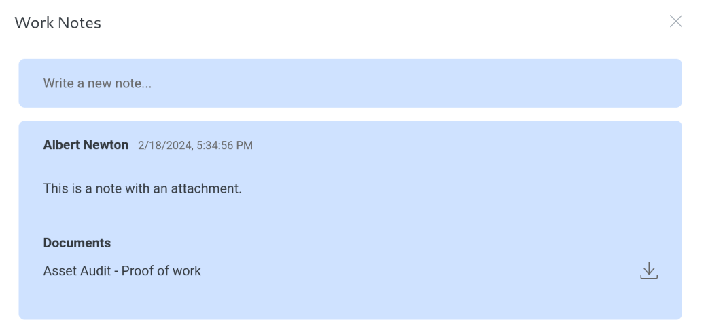
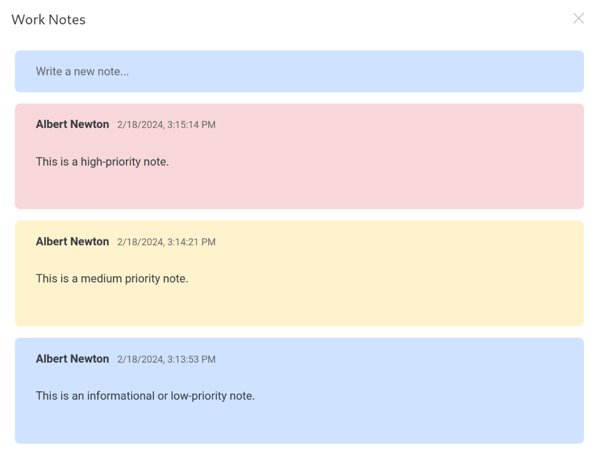
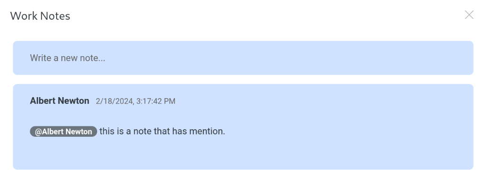

.. _Work-notes-doc:

**********
Work Notes
**********

Work Notes allow Hyperview users to add operational notes, mention fellow team members, and annotate with comments. Hyperview users can add Work Notes on Assets, Connections, and Circuits. Users can access Work Notes by using the Work Notes action button. 

.. image:: ./media/worknotes-header.png
   :width: 2091px
   :alt: Work Notes header
   :class: border-black

Work Notes can have attachments; once added, the attachments will be linked to the parent asset and the note. 

Work notes can have a priority. Changing the priority of the note will change the color of the notes.

Users with access to the asset can be mentioned in a Work Note using the common *@* syntax. The mentioned user will receive a notification linking the user back to the note when it is saved. 

Users with a Power User and above role can edit or delete Work Notes on assets they can access. 

.. image:: ./media/worknotes-with-delete-menu.png
   :width: 1039px
   :alt: Work Notes delete menu
   :class: border-black

.. note:: Actions on Work Notes generate appropriate asset change logs.

